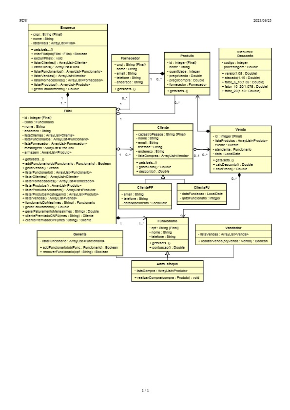

# Projeto-Final-MC322
Projeto Final de MC322 - Ofertado pelo Ph.D. Esther Luna Colombini

# Diagrama

# Desenvolvedores
[ Ludivik de Paula RA:235075 ](https://github.com/ldvk_bf) | [  Vinicius RA: 194940 ](https://github.com/vinicarvalhop020) | [  Caio RA: 212661 ](https://github.com/Caiozotex) |  [  Alexande Seixas RA: 250355 ](https://github.com/aleseixas)
| :---: | :---: | :---: | :---: |
